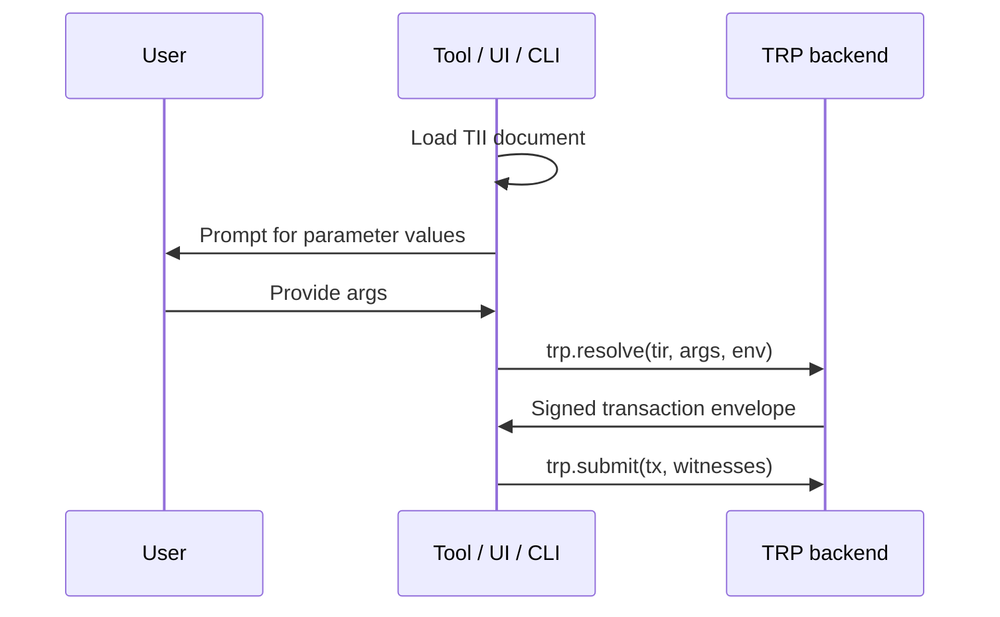

TII is the declarative JSON format that describes how the transactions in a Tx3 protocol can be invoked. A TII document lists the available transactions, the parameters each one accepts, the profiles (environments) those parameters can be evaluated under, and the compiled TIR bytecode the runtime needs to resolve them. TII documents are produced by `trix build`, not authored by hand.

The JSON Schema spec lives at [tx3-lang/tii](https://github.com/tx3-lang/tii) (`v1beta0/tii.json`).

A typical consumption flow looks like this:

A TII document is a stable interface contract: any tool that understands the schema — a CLI, a UI form generator, a code generator like `trix codegen` — can invoke the transactions in a protocol without knowing anything about the underlying Tx3 source.
