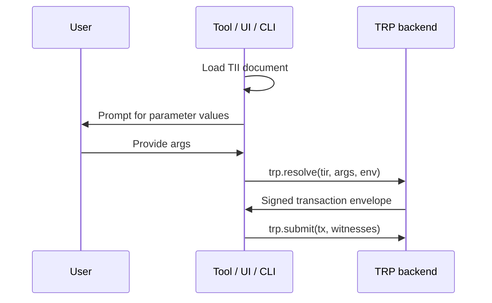

import { Aside } from '@astrojs/starlight/components';

The **Transaction Invocation Interface (TII)** is the declarative format the Tx3 toolchain uses to publish a protocol's *invocation surface*: the transactions a consumer can call, the arguments each one accepts, the environments they run in, and the compiled bytecode a runtime needs to resolve them. A TII document is a single JSON file. This page walks you through what's inside one, how it gets produced, and the three ways it gets consumed downstream.

## Why TII exists

When you write a `.tx3` file you're describing a protocol — parties, asset types, transaction templates. But a wallet, a CLI, or a frontend can't read Tx3 source. They need a stable, schema-described handshake that says: *here are the transactions you can invoke, here's the shape of their arguments, here's the bytecode the resolver needs.*

TII is that handshake. It's the published contract between the author of a protocol and everything downstream of it.

<Aside type="note">
TII is generated, not hand-authored. You never write `.tii` files yourself — `trix build` emits them from your `.tx3` source.
</Aside>

## Producing a TII

From the root of any Tx3 project:

```sh
trix build
```

Inside `trix build`, the Tx3 compiler (`tx3c`) reads your `.tx3` source, encodes the TIR (typed intermediate representation) for each declared transaction, and emits a single `<name>.tii` file alongside parameter schemas inferred from the source. Re-run `trix build` whenever your `.tx3` changes; treat the resulting `.tii` like a compiled artifact tied to that revision of the source.

## Anatomy of a TII document

Here's the full TII for the canonical `transfer` protocol — one party sending lovelace to another. We'll walk through each top-level key.

```json
{
  "tii": {
    "version": "v1beta0"
  },
  "protocol": {
    "name": "Basic value transfer protocol",
    "version": "1.0.0",
    "description": "Transfer funds between two addresses"
  },
  "environment": {
    "type": "object",
    "properties": {},
    "required": []
  },
  "parties": {
    "sender": {
      "description": "The party sending funds"
    },
    "receiver": {
      "description": "The party receiving funds"
    }
  },
  "transactions": {
    "transfer": {
      "description": "Transfer lovelace from sender to receiver",
      "tir": {
        "encoding": "hex",
        "content": "abc",
        "version": "v1beta0"
      },
      "params": {
        "type": "object",
        "required": ["quantity"],
        "properties": {
          "quantity": {
            "type": "integer",
            "minimum": 1
          }
        }
      }
    }
  },
  "profiles": {
    "cardano-preview": {
      "description": "Cardano preview testnet",
      "environment": {},
      "parties": {
        "sender": "addr_test1qp..."
      }
    }
  }
}
```

### `tii.version`

The TII schema version this document targets. Consumers use it to decide which validator and which set of expectations to apply. The current stable version is `v1beta0`.

### `protocol`

Human-facing metadata about the protocol: `name`, `version`, and an optional `description`. Codegen tools surface these in generated docstrings; UIs use them as page titles.

### `environment`

A JSON Schema describing the environment variables every profile must supply. Empty here, but a more realistic protocol might require things like a network identifier, a script address, or a policy ID. Because it's JSON Schema, validators and form generators get a free pass to render and check it.

### `parties`

The roles declared in the `.tx3` source. The transfer protocol has two: `sender` and `receiver`. Parties are placeholders — they get bound to concrete addresses (or signers) either through a profile, or at runtime when a consumer wires up its `Tx3Client`.

### `transactions`

A map keyed by transaction name. Each entry carries two things:

- `tir` — an envelope around the compiled bytecode the resolver needs. `encoding` says how the `content` blob is encoded (typically `hex`); `version` pins the TIR schema. Consumers don't read this — they forward it verbatim to a TRP server.
- `params` — a JSON Schema describing valid invocation arguments. This is what powers typed codegen, CLI prompts, and form UIs. The `transfer` transaction takes one required integer parameter, `quantity`, with `minimum: 1`.

### `profiles`

Named deployment contexts that bind concrete values to the abstract `environment` and `parties`. A protocol might ship with `cardano-preview`, `cardano-preprod`, and `mainnet` profiles, each pre-filling the addresses, network IDs, or script hashes appropriate for that target. Consumers select one with `withProfile("…")` (or the equivalent in their SDK).

### `components.schemas`

Not used by the transfer example, but worth knowing about: a place to declare shared JSON Schema fragments that transaction `params` can reference. Useful when several transactions share a complex argument type and you don't want to inline it everywhere.

## Consuming a TII

Three patterns cover almost everything tools do with a TII document.

### Typed clients via `trix codegen`

The most common path. `trix codegen` reads the `.tii` and emits a typed module in TypeScript, Rust, Go, or Python — one builder method per `tx` declared in the source, with argument types derived from each transaction's `params` schema. Your application imports the generated module and gets compile-time errors when it passes the wrong shape.

Go deeper in the [codegen guide](/tx3/consuming/codegen) or follow the end-to-end walkthrough in the [consuming quick-start](/tx3/consuming/quick-start).

### CLIs and UIs

Because every parameter is described by JSON Schema, a tool can render an invocation form directly from a TII — no codegen step required. `trix invoke` does exactly this: it loads the `.tii`, prompts you for each `params` field, picks a profile, and submits. The same pattern works for browser-based wallets that want to surface a protocol's transactions to end users.

### TRP backends

If you're building infrastructure rather than an application, your job is usually to forward an invocation to a TRP server: read the TII, ask the user (or another service) for argument values, then call `trp.resolve` with the `tir` blob and the validated arguments. The TII tells you *what* to ask for; TRP is *how* you ask the chain to resolve it.

See the [TRP page](/tx3/advanced/trp) for the wire protocol.

## TII vs TRP

It's easy to confuse the two — they often appear side by side. The split is:

- **TII** describes *what* transactions a protocol exposes. It's a static document.
- **TRP** describes *how* a client and a resolver talk on the wire to actually produce and submit a transaction. It's a live protocol.

A typical end-to-end flow puts them in sequence:



The tool reads TII to know what to ask for; it speaks TRP to get a transaction built.

## Design principles

A few principles shape why TII looks the way it does:

- **Schema-first.** Every parameter is described by JSON Schema; the format itself is JSON Schema. Validation, codegen, and UI rendering all fall out of the same source.
- **No runtime values in transactions.** Transactions describe shapes; profiles bind values. The same `transfer` transaction works on preview and mainnet — only its profile changes.
- **Profile-driven defaults.** Environment and party bindings live in profiles, not in transaction definitions.
- **Tooling-friendly.** The format is designed for validators, code generators, CLIs, and UIs — not for humans to write.
- **Self-contained.** The spec inlines every type definition it needs. No cross-document `$ref` resolution required to validate a TII.

## Spec & source

- JSON Schema: [`tx3-lang/tii` — `v1beta0/tii.json`](https://github.com/tx3-lang/tii/blob/main/v1beta0/tii.json).
- Worked example: [`examples/transfer.tii`](https://github.com/tx3-lang/tii/blob/main/examples/transfer.tii) — the file dissected above.
