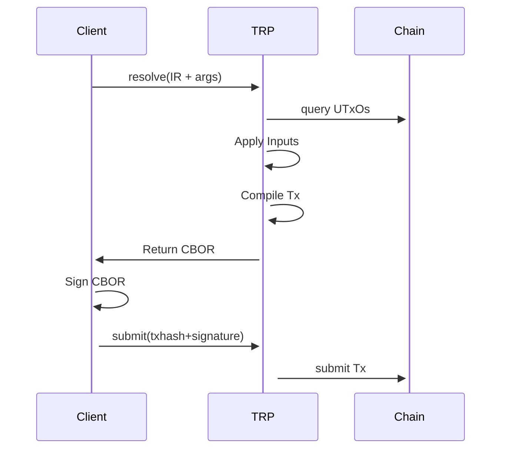

TRP is the wire protocol that backends speak to resolve and submit Tx3 transactions. The OpenRPC spec lives at [tx3-lang/trp](https://github.com/tx3-lang/trp) (`v1beta0/trp.json`).

Sequence diagram of how the Client interacts with the chain through a TRP endpoint.

