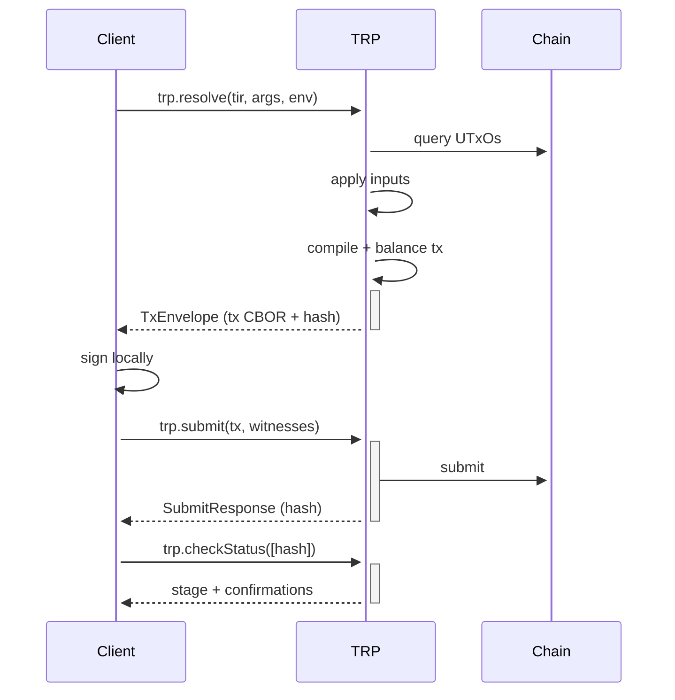

import { Aside } from '@astrojs/starlight/components';

The **Transaction Resolver Protocol (TRP)** is the JSON-RPC contract a Tx3 client uses to talk to a backend that knows how to turn a compiled transaction template into a real, on-chain transaction. A TRP server reads the chain, applies the template's input rules, compiles a balanced transaction, and hands the bytes back for signing — then accepts the signed transaction for submission. This page walks you through why TRP exists, the shape of the protocol, and the methods you'll actually call.

## Why TRP exists

A consumer of a Tx3 protocol has two things in hand: a compiled `tir` envelope (the bytecode produced by `trix build`) and a bag of argument values (e.g. `quantity = 5_000_000`). What it doesn't have is the state of the chain: which UTxOs match the template's `input` blocks, what the current fees are, what the protocol parameters look like.

Doing that work client-side would mean duplicating a node — querying UTxOs, applying input-selection logic, computing minimum fees, running script validation. TRP is the standardized RPC handshake that delegates all of it to a backend. The backend speaks the same TIR the compiler emits and the same JSON Schema for arguments the TII publishes, so any TRP-speaking server can resolve any Tx3 protocol.

<Aside type="note">
TRP is a wire protocol, not a library. SDKs ship a `TrpClient` (or equivalent) that wraps the calls below — you rarely hand-craft JSON-RPC requests. The shapes on this page are what those clients send and receive under the hood.
</Aside>

## The big picture

End-to-end, a client uses TRP twice per transaction: once to resolve, once to submit. In between, the client signs locally — TRP never touches private keys.



The optional `checkStatus` step is how clients poll the mempool lifecycle to know when a transaction is confirmed or finalized.

## The OpenRPC contract

TRP is published as an [OpenRPC](https://open-rpc.org/) document at [`tx3-lang/trp`](https://github.com/tx3-lang/trp) — current stable version `v1beta0/trp.json`. The spec is self-contained (no external `$ref`s) so tooling can validate, generate clients, or render API docs from it directly.

The document declares six methods, all under the `trp.*` namespace. The two you'll call on every transaction are `trp.resolve` and `trp.submit`. The rest support polling and mempool inspection.

## The core flow: resolve → submit

### `trp.resolve`

Asks the backend to turn a TIR envelope plus arguments into a ready-to-sign transaction.

**Params (`ResolveParams`):**

```json
{
  "tir": {
    "encoding": "hex",
    "content": "ab6466656573a169457...",
    "version": "v1alpha3"
  },
  "args": {
    "sender": "addr_test1qqxfzzm8cl05gssccyt3dtcp25fgrcfw6akjp9r4wtx09ujl8vdgga5pvrmprvd67asp7tr6vrwwnjku5l7ly4xhq9esagp6ag",
    "receiver": "addr_test1qqxfzzm8cl05gssccyt3dtcp25fgrcfw6akjp9r4wtx09ujl8vdgga5pvrmprvd67asp7tr6vrwwnjku5l7ly4xhq9esagp6ag",
    "quantity": 5000000
  },
  "env": {}
}
```

- `tir` — the compiled bytecode envelope, copied verbatim from a TII document's `transactions.<name>.tir` field. `encoding` is `hex` or `base64`; `version` pins the TIR schema so the server can refuse anything it doesn't speak.
- `args` — an open key-value map of argument values. Whatever the transaction's `params` JSON Schema in TII declared, supply it here. Argument names match the parameter names in the `.tx3` source.
- `env` — environment overrides (network IDs, script addresses, policy IDs). Most invocations leave this empty and rely on the server's configured defaults; you only populate it when a protocol's TII declares `environment` properties.

**Result (`TxEnvelope`):**

```json
{
  "tx": "84a600d910...",
  "hash": "5663c3e28539f4b847043cf2b1d87e5e4bd3e070a76dcfb3fd8170218486eff1"
}
```

`tx` is the hex-encoded CBOR of the balanced transaction body; `hash` is its transaction ID. The client signs `tx` locally and ships the result back via `trp.submit`.

### `trp.submit`

Submits a resolved transaction together with one or more witnesses.

**Params (`SubmitParams`):**

```json
{
  "tx": {
    "content": "84a600d910...",
    "contentType": "application/cbor"
  },
  "witnesses": [
    {
      "key":       { "content": "aabbccdd...", "contentType": "ed25519/public-key" },
      "signature": { "content": "11223344...", "contentType": "ed25519/signature" },
      "type": "vkey"
    }
  ]
}
```

A witness is either a `TxSignature` (key + signature + a `type` tag like `vkey` for vkey witnesses) or a raw `BytesEnvelope` for chain-specific witness encodings. The server merges witnesses into the transaction body and forwards it to the chain.

**Result (`SubmitResponse`):**

```json
{ "hash": "5663c3e28539f4b847043cf2b1d87e5e4bd3e070a76dcfb3fd8170218486eff1" }
```

You typically already know the hash from the resolve step; the server returns it again so clients that submit cached envelopes don't need to recompute it.

## Resolve error model

`trp.resolve` is where most user-facing failures surface, so TRP defines four structured error codes. Each carries a `data` field with a typed diagnostic so clients can render an actionable message rather than dump raw JSON.

| Code      | Meaning                      | Diagnostic                                                                                                |
| --------- | ---------------------------- | --------------------------------------------------------------------------------------------------------- |
| `-32000`  | Unsupported TIR              | `provided` and `expected` version strings — the server doesn't speak the TIR version in your envelope.    |
| `-32001`  | Missing transaction argument | `key` and `type` of the missing arg — your `args` map is incomplete.                                      |
| `-32002`  | Input not resolved           | The input `name`, its `query` (address, min amounts, refs), and a `search_space` showing how many UTxOs matched each criterion. |
| `-32003`  | Tx script failure            | An array of `logs` from the script's evaluation — typically Plutus trace output.                          |

The richest of these is `InputNotResolvedDiagnostic`: it reports `by_address_count`, `by_asset_class_count`, and `by_ref_count` separately, so a client can tell a user "the sender's address has 12 UTxOs, but none holds 5 ADA worth of lovelace" rather than a generic "input not resolved."

## Status and mempool methods

Once a transaction is submitted, the remaining methods let clients (or operators) track it through the mempool.

### `trp.checkStatus`

Pass an array of transaction hashes; get back a map of hash → `TxStatus`. Use it to poll until a tx reaches the stage you care about — SDK helpers like `waitForConfirmed` are thin loops over this call.

```json
{ "hashes": ["5663c3e285..."] }
```

A `TxStatus` carries `stage`, `confirmations`, `nonConfirmations`, and an optional `confirmedAt` (`ChainPoint` = slot + block hash) once the tx lands. The `stage` enum captures the full lifecycle:

- `pending` — accepted by this server, not yet propagated.
- `propagated` — sent to peers.
- `acknowledged` — peers acknowledged receipt.
- `confirmed` — included in a block.
- `finalized` — block is past the chain's stability threshold.
- `dropped` — evicted from the mempool (e.g. expired, replaced).
- `rolled_back` — the containing block was rolled back.
- `unknown` — the server has no record of this hash.

### `trp.dumpLogs`

Paginated history of finalized transactions the server has seen. Pass a `cursor` (server-provided), a `limit`, and `includePayload` to control whether each `TxLog` entry includes the raw CBOR. Useful for indexers and audit tools that want to reconstruct chain activity through the same server that produced it.

### `trp.peekPending` / `trp.peekInflight`

Two mempool views.

- `peekPending` returns transactions the server has accepted but not yet propagated — the local-only slice of the mempool.
- `peekInflight` returns transactions that are out in the wider mempool (propagated, acknowledged, confirmed-but-unstable), each with its current `TxStatus`.

Both accept `includePayload` if you want the CBOR alongside the metadata.

## TRP vs TII

- **TII** describes *what* transactions a protocol exposes. It's a static document — see [TII](/tx3/advanced/tii).
- **TRP** describes *how* a client and a resolver talk on the wire to actually produce and submit one. It's a live RPC contract.

A typical invocation reads the TII once to learn the surface, then makes TRP calls every time it wants to act.

## Available backends

To use TRP from an application, you need a server that speaks it. The current production-grade option is:

- **[Dolos](https://docs.txpipe.io/dolos)** — a lightweight Cardano data node that exposes a TRP endpoint out of the box. It's the same engine `trix devnet` uses to run a local ephemeral chain, and it's what hosted endpoints (e.g. Demeter's preview/preprod TRP) run under the hood.

If you point a TRP client at `http://localhost:8545` after `trix devnet`, or at a hosted Demeter endpoint like `https://cardano-preview.trp-m1.demeter.run`, you're talking to a Dolos instance.

## Reference implementation

The canonical *client* is the [`tx3-resolver`](https://github.com/tx3-lang/tx3/tree/main/crates/tx3-resolver) Rust crate in `tx3-lang/tx3`. The language SDKs (`tx3-sdk` for TypeScript, Rust, Go, Python) all wrap a TRP client of their own; if you're building a new backend, `tx3-resolver` is the reference for what a conforming consumer expects on the wire.

## Spec & source

- OpenRPC document: [`tx3-lang/trp` — `v1beta0/trp.json`](https://github.com/tx3-lang/trp/blob/main/v1beta0/trp.json).
- Reference client: [`tx3-resolver`](https://github.com/tx3-lang/tx3/tree/main/crates/tx3-resolver).
